# hata - пошук житла на OLX.UA

### Сервіс який переглядає оголошення з орендою житла на olx.ua у вибраних населених пунктах та одразу надсилає нові оголошення у необхідну telegram групу

1. Необхідна машина з операційною системою Ubuntu 20.04 (18.04)
2. Встановити Docker (https://docs.docker.com/engine/install/ubuntu/#set-up-the-repository). Виконати наступні команди у терміналі крок за кроком:
   1. ```sudo apt-get update```
   2. ```sudo apt-get install ca-certificates curl gnupg lsb-release git```
   3. ```curl -fsSL https://download.docker.com/linux/ubuntu/gpg | sudo gpg --dearmor -o /usr/share/keyrings/docker-archive-keyring.gpg```
   4. ```echo "deb [arch=$(dpkg --print-architecture) signed-by=/usr/share/keyrings/docker-archive-keyring.gpg] https://download.docker.com/linux/ubuntu $(lsb_release -cs) stable" | sudo tee /etc/apt/sources.list.d/docker.list > /dev/null```
   5. ```sudo apt-get update```
   6. ```sudo apt-get install docker-ce docker-ce-cli containerd.io```
   7. ```sudo usermod -a -G docker $USER```
3. Встановити Docker-Compose (https://docs.docker.com/compose/install/#install-compose-on-linux-systems). Виконати наступні команди у терміналі крок за кроком:
   1. ```sudo curl -L "https://github.com/docker/compose/releases/download/1.29.2/docker-compose-$(uname -s)-$(uname -m)" -o /usr/local/bin/docker-compose```
   2. ```sudo chmod +x /usr/local/bin/docker-compose```
4. **На цьому етапі необхідно обов'язково перезавантажити комп'ютер!**
5. Клонувати проект ```git clone https://github.com/VladimirKritov/hata.git```
6. Створити telegram бота та отримати токен.
   1. Через пошук у telegram знайти бота @BotFather
   
   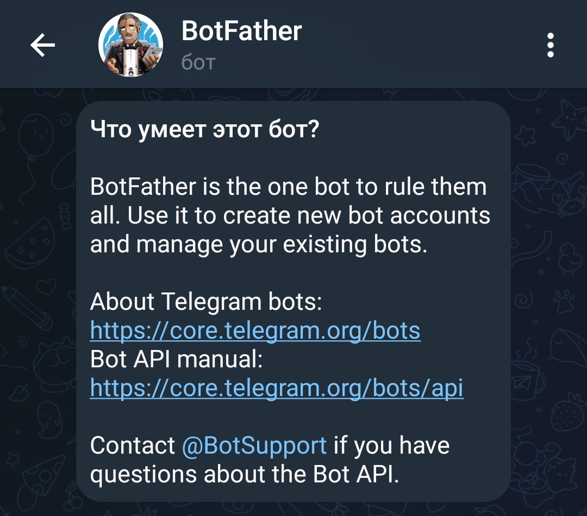
   
   2. За допомогою команди ```/newbot``` створити нового бота: <ім'я бота>_bot.
   
   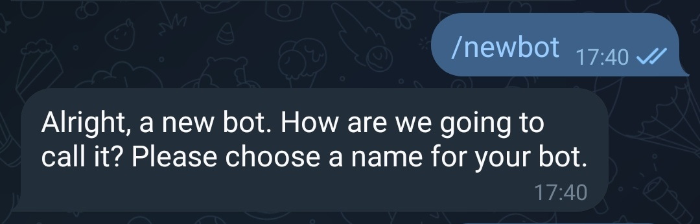
   
   3. Зберегти токен після створення бота.
   
   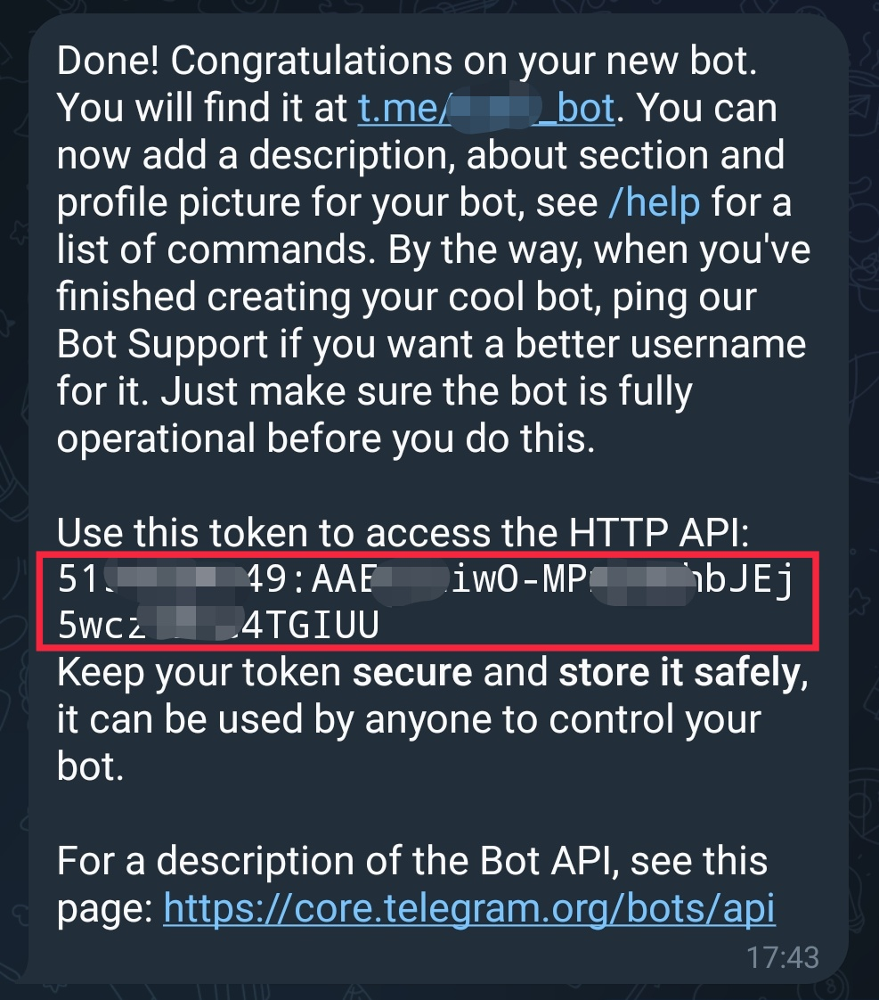
   
7. Створити у telegram групу та додати туди створеного бота. **Обов'язково додати бота в адміністратори групи!**

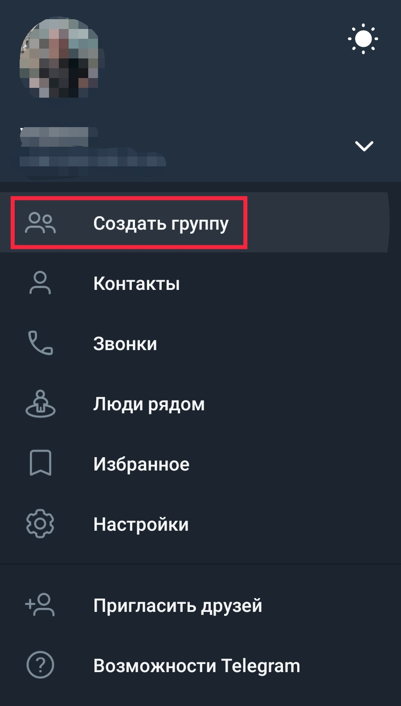
<br/>

<br/>
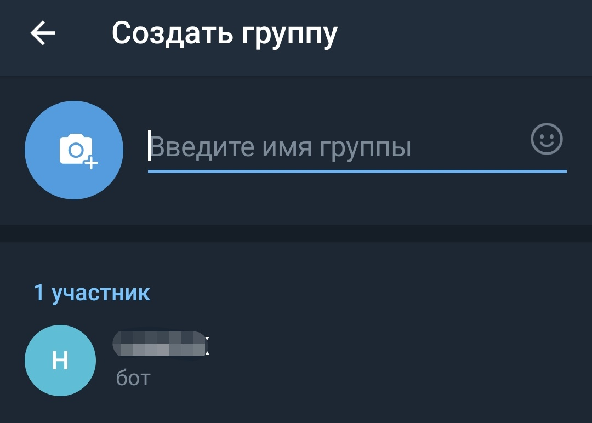
<br/>
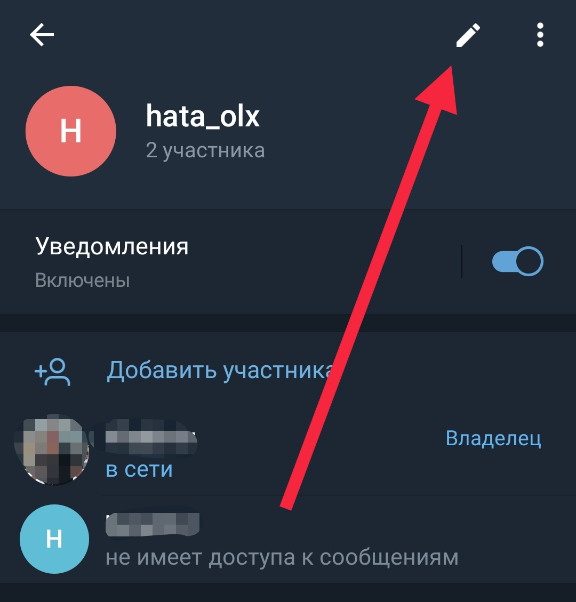
<br/>
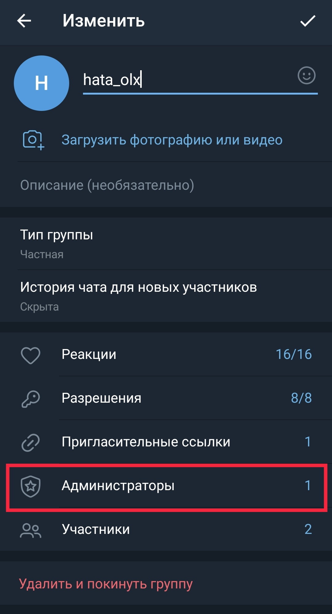
<br/>
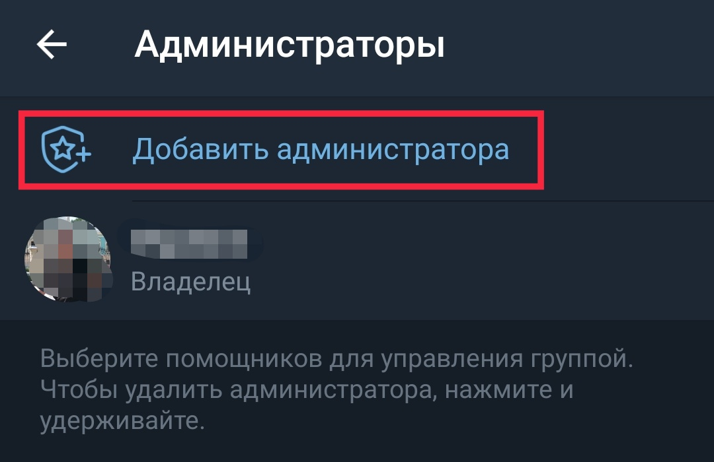
<br/>
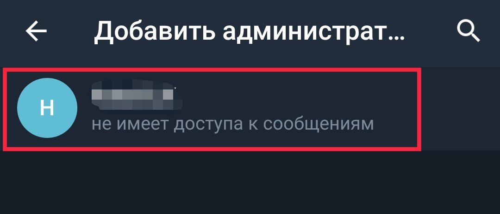
<br/>
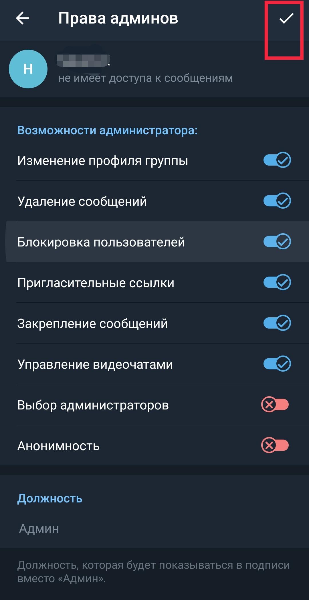
<br/>
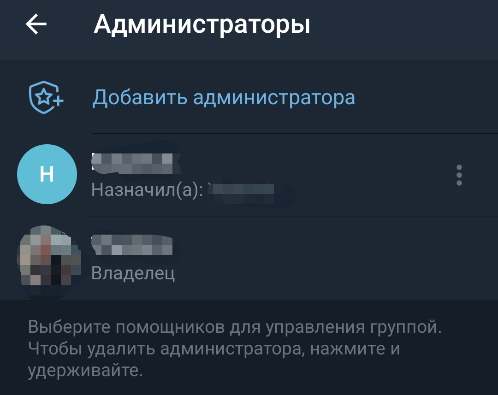
<br/>
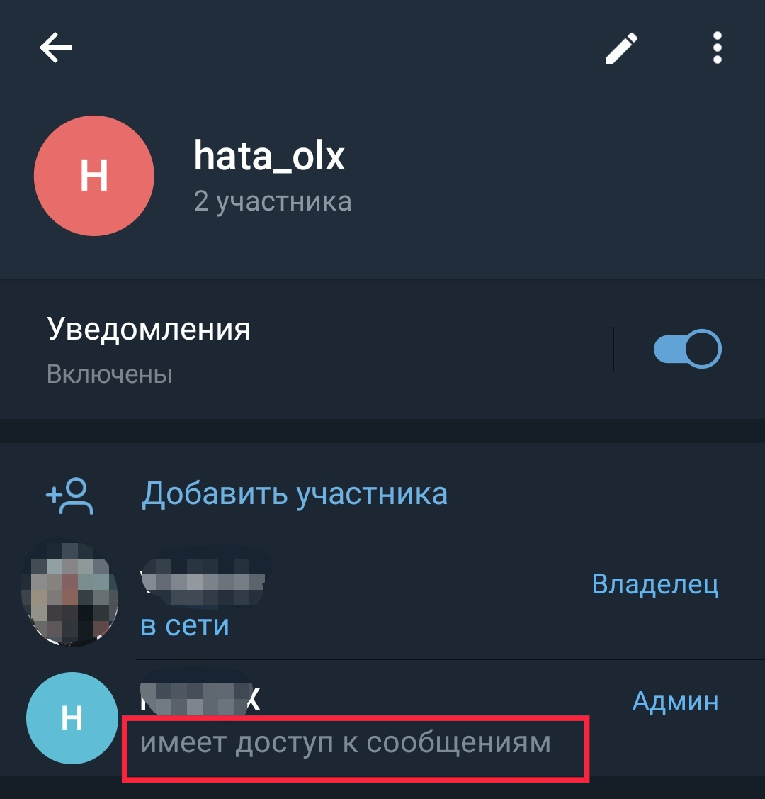

8. Дізнатися id групи, можна переглянути тут ```https://api.telegram.org/bot<BOT_TOKEN>/getUpdates``` (my_chat_member --> chat --> id)

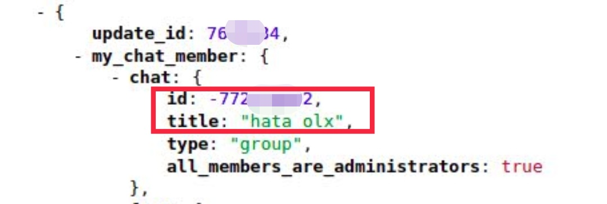

9. Виконати команду запуску у терміналі для ініціалізації файлів: ```sh init.sh```
10. В файлі **data/token.txt** вказати токен бота та id групи:
```commandline
<BOT_TOKEN>
<CHAT_ID>
```
Приклад:
```commandline
5114004139:AAEKliiwO-MPm2PDhb5Ej5wcztBre4TGIUU
-1051663062839
```
10. В файлі **data/locations.txt** вказати населені пункти, в яких необхідно здійснювати пошук. Написання населених пунктів необхідно брати з урла на olx.ua, вибираючи там локацію. Наприклад в https://www.olx.ua/d/nedvizhimost/kvartiry/dolgosrochnaya-arenda-kvartir/ternopol/?currency=UAH беремо ternopol
```commandline
chernovtsy
ternopol
uzhgorod
```
11. Виконати команду запуску у терміналі: ```sh run.sh```
