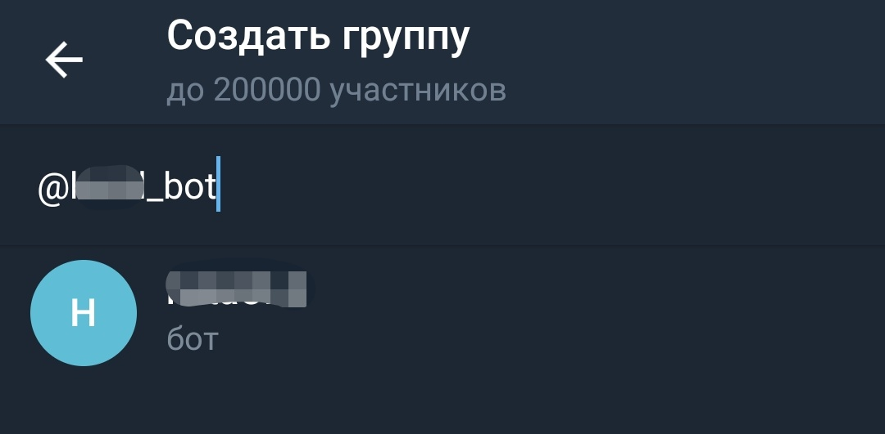

# hata - пошук житла на OLX.UA

### Сервіс який переглядає оголошення з орендою житла на olx.ua у вибраних населених пунктах та одразу надсилає нові оголошення у необхідну telegram групу

1. Необхідна машина з операційною системою Ubuntu 20.04 (18.04). Якщо машина на Windows або MacOS можна встановити VirtualBox, завантажити образ з Ubuntu і запустити сервіс на ньому (дивіться нижче)
2. Встановити Git, виконавши команду у терміналі ```sudo apt-get -y install git```
3. Клонувати проект, виконавши команду у терміналі ```git clone https://github.com/VladimirKritov/hata.git```
4. Перейти до клонованого проекту, виконавши команду у терміналі ```cd hata```
5. Встановити Docker та Docker-Compose, виконавши команду у терміналі ```sudo sh install_docker.sh```
6. Створити telegram бота та отримати токен.
   1. Через пошук у telegram знайти бота ```@BotFather```
   
   
   
   2. За допомогою команди ```/newbot``` створити нового бота: <ім'я бота>_bot.
   
   
   
   3. Зберегти токен після створення бота.
   
   
   
7. Створити у telegram групу та додати туди створеного бота. **Обов'язково додати бота в адміністратори групи!**


<br/>

<br/>

<br/>

<br/>

<br/>

<br/>

<br/>

<br/>

<br/>


8. Дізнатися id групи, можна переглянути тут ```https://api.telegram.org/bot<BOT_TOKEN>/getUpdates``` (my_chat_member --> chat --> id)


9. Виконати команду у терміналі для ініціалізації txt файлів: ```sh init_txt_files.sh```
10. В файлі **token.txt** (розташування data / token.txt) вказати токен бота та id групи:
```commandline
<BOT_TOKEN>
<CHAT_ID>
```
Приклад:
```commandline
5114004139:AAEKliiwO-MPm2PDhb5Ej5wcztBre4TGIUU
-1051663062839
```
11. В файлі **locations.txt** (розташування data / locations.txt) вказати населені пункти, в яких необхідно здійснювати пошук. Написання населених пунктів необхідно брати з урла на olx.ua, вибираючи там локацію. Наприклад в https://www.olx.ua/d/nedvizhimost/kvartiry/dolgosrochnaya-arenda-kvartir/ternopol/?currency=UAH беремо ternopol
```commandline
chernovtsy
ternopol
uzhgorod
```
12. Виконати команду запуску у терміналі: ```sudo sh run.sh```

## VirtualBox

1. Встановити VirtualBox для своєї операційної системи https://www.virtualbox.org/wiki/Downloads
2. Завантажити та встановити образ з Ubuntu https://drive.google.com/drive/folders/1stTqH8I9JHPmjIK4DKLap-3B4hp0n8f9, в якому вже виконано перші п'ять пунктів
3. Запустити віртуалку, пароль ```hata```
4. Щоб потрапити до директорії з сервісом необхідно відкрити термінал та виконати команду ```cd hata```
5. Залишилося виконати налаштування пов'язані з telegram: створити бота, групу та прописати токен бота з id створеної групи (це пункти з 6 по 10).  В 11 пункті правильно вибрати та прописати необхідні населені пункти.  І нарешті використати команду запуску сервісу з 12 пункта.
